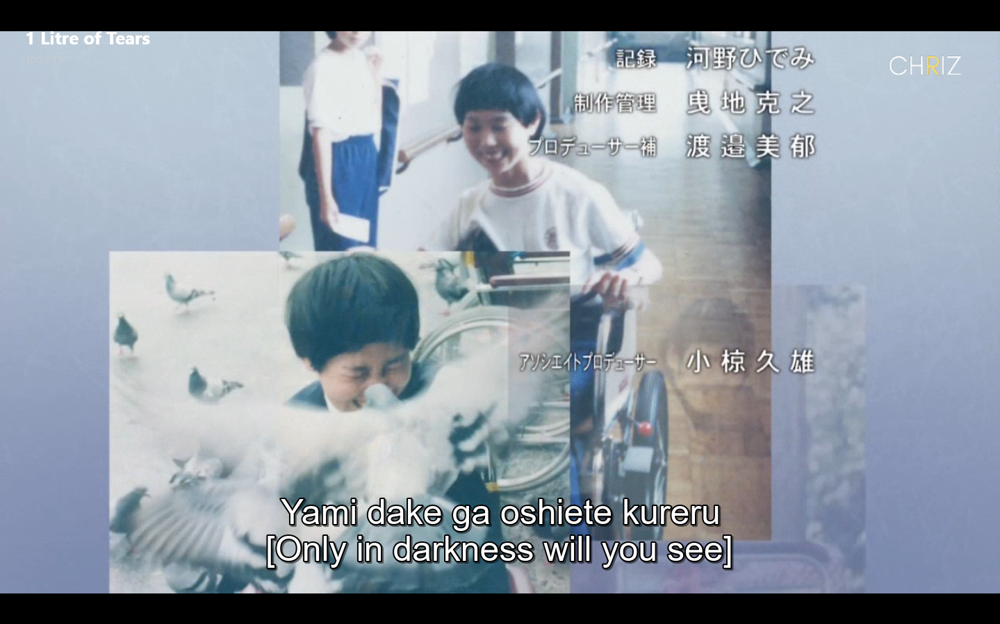
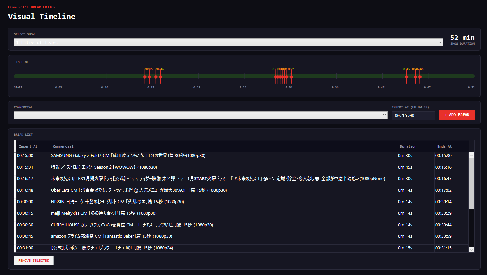
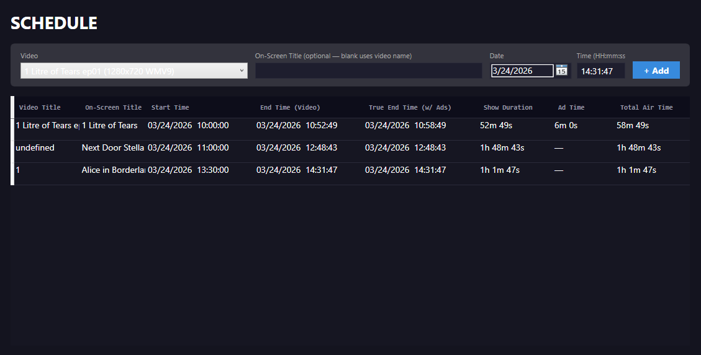

<div align="center">

# 📡 Home TV Station

**A home-based video scheduler and player that simulates a real broadcast television station.**

Schedule your own shows, insert commercial breaks, fill gaps automatically with ads, and watch it all play back like a live TV channel — complete with on-screen overlays showing what's on, what's next, and your station logo.


</div>

---

## ✨ Features

### 📺 Live TV Playback
- Opens a fullscreen player that behaves like a real TV channel
- Automatically seeks to the correct position when you open the player mid-show — if a show started 20 minutes ago, it plays from the 20-minute mark
- Smooth handoff between shows at their scheduled times

### 🗓️ Schedule Manager
- Schedule any video from your library to air at a specific date and time
- Overlap detection — warns you if a new show conflicts with an existing one
- **True End Time** awareness — prevents scheduling a new show before the previous show's commercials finish
- Auto-fills the next suggested start time after each entry

### 📢 Commercial Breaks
- Assign specific commercials to specific shows at specific offsets (e.g. insert Ad X at 15:00 into Show Y)
- Visual timeline showing every break as a marker on a track bar
- **Overlap prevention** — blocks adding a commercial if it would overlap another break
- **Next-show conflict detection** — prevents adding a commercial if it would push the show's true end past the next show's start
- Displays each commercial's duration and end offset in the break list

### 🎬 Gap Filler
- Automatically fills empty time between shows with commercials
- Weighted random selection — assign weights (1–10) to commercials to control how often they play
- Cooldown system — recently played commercials are penalised to avoid repetition
- Precise wall-clock cut timer — switches between gap-fill commercials at exact times

### 🖥️ Broadcast Overlay
- Transparent overlay on the player showing:
  - **Now Playing** — current show title (slides in from left)
  - **Clock** — live time display beneath the title
  - **Up Next** — next scheduled show, appears 3 seconds after title then fades
  - **Channel Logo** — your custom logo, top-right, permanently visible
- Fully configurable — toggle overlay on/off, adjust logo size and opacity in Settings

### 📊 Dashboard
- Full broadcast schedule view on the main menu
- Shows grouped by date with a **LIVE** badge for today
- **ON AIR NOW** highlight for the currently airing show
- Commercial sub-rows under each show showing offset, duration, and end time
- Updates live as you add/remove shows or commercial breaks

### ⚙️ Settings
- Upload a custom channel logo (PNG, JPG, BMP, ICO, GIF)
- Adjust logo size (40–200px) and opacity (10–100%) with live preview
- Toggle overlay visibility globally
- Toggle auto gap-fill commercials on/off
- All settings persist across sessions

---

## 🖼️ Screenshots





---

## 🚀 Getting Started

### Requirements
- Windows 10 or Windows 11 (64-bit)
- No additional runtime needed — the installer is self-contained

### Installation
1. Download `HomeTVStation_Setup_v1.0.0.exe` from the [Releases](../../releases) page
2. Run the installer and follow the setup wizard
3. Launch **Home TV Station** from your Start Menu or Desktop shortcut

### First-Time Setup
1. **Add Videos** → Open *Video Library* → click **+ Add Files** or **+ Add Folder**
2. **Schedule Shows** → Open *Schedule* → pick a video, set a date/time, click **+ Add**
3. **Add Commercials** (optional) → Open *Commercial Library* → add your ad clips
4. **Set Break Points** (optional) → Open *Commercial Breaks* → select a show, pick a commercial, set an offset
5. **Open Player** → Click *Video Player* on the main menu

---

## 🏗️ Architecture

This project follows the **MVVM (Model-View-ViewModel)** pattern using WPF.

```
Home TV Station/
├── Models/                     # Data models
│   ├── VideoModel.cs           # A video in the library
│   ├── ScheduleItem.cs         # A scheduled show entry (with TrueEndTime)
│   ├── CommercialModel.cs      # A commercial clip (with weight)
│   └── CommercialBreak.cs      # A break point assigned to a show
│
├── Services/                   # Singletons & business logic
│   ├── DataFolder.cs           # Central AppData path (%APPDATA%\HomeTVStation)
│   ├── AppSettings.cs          # User preferences (logo, toggles, size/opacity)
│   ├── VideoStore.cs           # Video library + schedule (loads videos.csv, schedule.csv)
│   ├── CommercialStore.cs      # Commercial library (loads commercials.csv)
│   ├── CommercialBreakStore.cs # Break assignments + TrueEndTime helpers
│   ├── ScheduleService.cs      # Schedule CSV persistence
│   ├── SchedulerService.cs     # 1-second DispatcherTimer — fires VideoShouldPlay events
│   ├── GapFillerService.cs     # Weighted commercial queue builder for gaps
│   └── MediaDurationReader.cs  # Batch LibVLC duration reader (one instance for whole batch)
│
├── ViewModels/                 # MVVM ViewModels
│   ├── PlayerViewModel.cs      # Singleton — manages LibVLC playback, overlay state
│   ├── MainMenuViewModel.cs    # Dashboard data, navigation commands, live refresh
│   ├── ScheduleViewModel.cs    # Add/remove schedule entries, conflict detection
│   ├── CommercialBreakViewModel.cs  # Break assignment, overlap/conflict checks
│   ├── VideoLibraryViewModel.cs     # Multi-file/folder add, async duration reading
│   ├── CommercialLibraryViewModel.cs # Same, with weight management
│   └── SettingsViewModel.cs    # Logo path, size, opacity, feature toggles
│
├── Views/                      # WPF Windows
│   ├── MainMenu.xaml/.cs       # Dashboard + navigation sidebar
│   ├── Player.xaml/.cs         # Fullscreen player (VideoView + overlay management)
│   ├── OverlayWindow.xaml/.cs  # Transparent topmost overlay (NowPlaying, logo, UpNext)
│   ├── Schedule.xaml/.cs       # Schedule manager with TrueEndTime columns
│   ├── CommercialBreakView.xaml/.cs  # Visual timeline editor
│   ├── VideoLibrary.xaml/.cs   # Video library with status bar
│   ├── CommercialLibrary.xaml/.cs    # Commercial library with weight sliders
│   └── Settings.xaml/.cs       # Settings panel
│
└── Converters/                 # WPF value converters
    ├── NullToBoolConverter.cs
    ├── StringToVisibilityConverter.cs
    ├── NullOrEmptyToVisibilityConverter.cs
    └── EmptyStringToPlaceholderConverter.cs
```

---

## 🔧 Building from Source

### Prerequisites
- Visual Studio 2026 (Community or higher)
- .NET 10.0 SDK
- NuGet packages (restored automatically):
  - `LibVLCSharp.WPF` 3.x
  - `VideoLAN.LibVLC.Windows` 3.x

### Steps
```bash
# Clone the repository
git clone https://github.com/chrismgbhs/Home-Based-Video-Scheduler-and-Player-as-Television.git
cd Home-Based-Video-Scheduler-and-Player-as-Television

# Open in Visual Studio
start "Home-Based Video Scheduler and Player as Television.sln"

# Or build from CLI
dotnet restore
dotnet build -c Release
```

### Publishing (Self-Contained)
```bash
dotnet publish -c Release -r win-x64 --self-contained true -o ./publish
```

The `publish/` folder contains everything needed — copy it anywhere and run the `.exe`.

### Building the Installer
Requires [Inno Setup](https://jrsoftware.org/isinfo.php):
1. Edit `HomeTVStation_Setup.iss` — update `PublishFolder` to your publish output path
2. Open the `.iss` file in Inno Setup
3. Press `Ctrl+F9` to compile
4. Find `HomeTVStation_Setup_v1.0.0.exe` at the configured output path

---

## 📁 Data Storage

All user data is stored in:
```
%APPDATA%\HomeTVStation\
├── videos.csv              # Video library
├── schedule.csv            # Schedule entries
├── commercials.csv         # Commercial library
├── commercial_breaks.csv   # Break assignments
└── settings.ini            # User preferences
```

This location is always writable regardless of where the app is installed, and data persists across app updates.

---

## 🎛️ How It Works

### Scheduling & True End Time
Every `ScheduleItem` has two end times:
- **EndTime** — when the video file itself finishes
- **TrueEndTime** — `EndTime` + total duration of all assigned commercial breaks

When scheduling a new show, the system checks `TrueEndTime` of all existing shows to prevent any overlap. The Schedule Manager's auto-fill and the textbox default both use `TrueEndTime` so you never accidentally schedule into a commercial break.

### Playback Engine
`PlayerViewModel` is a singleton that owns the LibVLC `MediaPlayer`. When the player window opens:
1. `VideoViewControl.MediaPlayer` is assigned (must happen before `Play()`)
2. `OnPlayerWindowReady()` is deferred to `DispatcherPriority.Loaded` so the HWND is fully bound
3. `GetCurrentItem()` finds the current schedule entry and seeks to the live position
4. A `BreakWatcher` DispatcherTimer (1s, Background priority) polls `MediaPlayer.Time` and fires commercial breaks at their offsets
5. After each commercial, the show resumes from the saved position

### Overlay System
The overlay is a separate `Window` with `WS_EX_TRANSPARENT | WS_EX_NOACTIVATE` Win32 flags, positioned over the player. It's forced topmost via `SetWindowPos(HWND_TOPMOST)` because LibVLCSharp's `VideoView` creates a native Win32 HWND child that always renders above WPF content — a separate window is the only reliable way to draw on top of it.

### Gap Filler
When no show is scheduled for a time period, `GapFillerService` builds a queue of commercials to fill the gap. Each slot has a `WallStopTime` — a `DispatcherTimer` fires at that exact wall-clock time to cut to the next commercial or to a show if one starts. This avoids any drift from relying on `MediaPlayer.Time`.

---

## 🤝 Contributing

Pull requests are welcome. For major changes, please open an issue first to discuss what you'd like to change.

1. Fork the repository
2. Create your feature branch: `git checkout -b feature/your-feature`
3. Commit your changes: `git commit -m 'Add some feature'`
4. Push to the branch: `git push origin feature/your-feature`
5. Open a Pull Request

---

## 📄 License

This project is licensed under the MIT License — see the [LICENSE](LICENSE) file for details.

---

## 🙏 Acknowledgements

- [LibVLCSharp](https://github.com/videolan/libvlcsharp) — .NET bindings for LibVLC
- [VideoLAN / VLC](https://www.videolan.org/) — the underlying media engine
- [Inno Setup](https://jrsoftware.org/isinfo.php) — installer builder

---

<div align="center">
Made with ❤️ by Chris Boen Magbuhos
</div>
